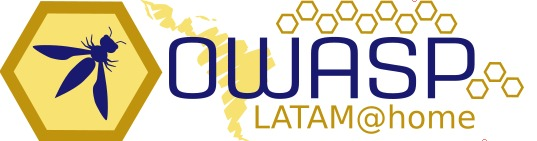

---

title: ctf
displaytext: Capture The Flag
layout:  col-sidebar
tab: true
order: 5
tags: LatamTour2020

---
 

  

  

## CTF OWASP LATAM
En esta versión LATAM@home 2020 es un juego que pondrá a prueba tus conocimientos en hacking y seguridad informática. Consiste en superar una serie de retos ordenados por categorías (web, cripto, exploiting, reversing, misc, etc) Al final de cada reto obtendrás un "flag" que debes usar para sumar puntos. Gana el participante con más puntos!

La competencia será desde el jueves 7 a las 6:00am (GMT-5) hasta el viernes 8 a las 10:00pm

Registrate en: [http://ctf.owasplatam.org/](http://ctf.owasplatam.org/)

## CTF Secure Code Warrior

¡Mejore sus habilidades de programación segura! Participe en torneo de OWASP Latam@Home 2020 desde el 4 de mayo a las 2:00PM (GMT-5) hasta el 8 de mayo a las 4:30PM (GMT-5). 

Compita contra otros participantes en una serie de desafíos de códigos vulnerables donde tendrá que identificar el problema, localizar el código inseguro y solucionar la vulnerabilidad.

Todos los desafíos estaran basados en el OWASP Top 10 y los jugadores podrán elegir competir con una variedad de lenguajes de programación, incluyendo Java EE, Java Spring, C# MVC, C# WebForms, Go, Ruby on Rails, Python Django & Flask, Scala Play, Node .JS, React y los lenguajes de programación de iOS y Android.

A lo largo del torneo los jugadores deberán ganar puntos para subir a la cima y ser el mejor. ¡Los finalistas ganarán premios!

La competencia será desde el lunes 4 a las 2:00pm (GMT-5) hasta el viernes 8 a las 4:30pm
 
Registrate en: [http://discover.securecodewarrior.com/OWASP-LATAM-torneo.html](http://discover.securecodewarrior.com/OWASP-LATAM-torneo.html)
